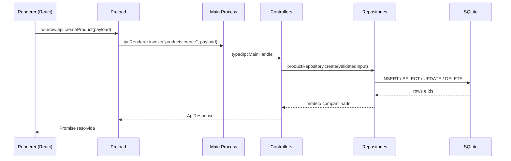

# Arquitetura

## 1. Visão geral

O sistema é um aplicativo desktop construído com Electron, React, TypeScript e SQLite via Drizzle ORM (`drizzle-orm`). O código-fonte atual está organizado em `app/`, com separação clara entre main process, preload, renderer e tipos compartilhados.

| Camada       | Responsabilidade                                                            |
| ------------ | --------------------------------------------------------------------------- |
| Main process | Inicializar o app, abrir a janela, registrar IPC e controlar a persistência |
| Preload      | Expor uma API segura ao renderer via `contextBridge`                        |
| Renderer     | Renderizar a interface React e manter o estado de UI                        |
| Shared       | Compartilhar contratos, modelos e DTOs entre as camadas                     |

> O renderer não acessa banco de dados, filesystem ou módulos Node.js diretamente. Toda operação de dados passa pelo IPC definido em `docs/api-contracts.md`.

### 1.1 Organização do código

```txt
app/
├── app.ts
├── backend/
│   ├── preload.ts
│   ├── controllers/
│   │   ├── productsController.ts
│   │   └── salesController.ts
│   ├── infra/
│   │   ├── typedIpc.ts
│   │   └── database/
│   │       ├── sqlite.ts
│   │       ├── schema.ts
│   │       ├── helpers.ts
│   │       ├── paths.ts
│   │       └── tables/
│   │           ├── productTables.ts
│   │           └── saleTables.ts
│   └── repository/
│       ├── productRepository.ts
│       └── saleRepository.ts
├── frontend/
│   ├── index.html
│   ├── vite.config.ts
│   └── src/
└── shared/
    ├── index.ts
    ├── contracts/
    ├── models/
    └── types/
```

### 1.2. Pontos de entrada

| Arquivo                     | Papel                                                             |
| --------------------------- | ----------------------------------------------------------------- |
| `app/app.ts`                | Bootstrap do Electron, inicialização do banco e criação da janela |
| `app/backend/preload.ts`    | Exposição de `window.api` para o renderer                         |
| `app/frontend/src/main.tsx` | Entrada do React                                                  |
| `app/shared/index.ts`       | Reexportação dos contratos e modelos compartilhados               |

No build final, o frontend é gerado em `dist/app/renderer/` e o main process em `dist/app/`.

### 1.3. Fluxo de inicialização

1. `app/app.ts` aguarda `app.whenReady()`;
2. `initializeDrizzle()` abre ou cria `app-drizzle.db` em `appData/data/` e aplica as migrações;
3. `migrateLegacyDatabase()` importa os dados do banco antigo `app.db`, se ele existir;
4. `registerProductHandlers()` e `registerSaleHandlers()` registram os canais IPC;
5. A janela carrega o `index.html` do frontend compilado;

## 2. Fluxo de dados



## 3. Persistência

| Arquivo                                   | Função                                                                            |
| ----------------------------------------- | --------------------------------------------------------------------------------- |
| `app/backend/infra/database/config.ts`    | Inicializa `better-sqlite3` com Drizzle, abre o banco e persiste `app-drizzle.db` |
| `app/backend/infra/database/schema.ts`    | Cria as tabelas e aplica migrações simples de colunas                             |
| `app/backend/infra/database/migration.ts` | Importa o banco legado `app.db` quando existe                                     |
| `app/backend/repository/*`                | Centraliza as operações de dados e os mapeamentos de domínio                      |

Regras da camada de persistência:

- O banco é acessado apenas pelo main process.
- `created_at` e `updated_at` são gerados nas tabelas e atualizados pelo Drizzle.
- Os repositories usam Drizzle ORM para as operações principais e SQL explícito apenas em pontos auxiliares como backup e migração.
- `sale_items` usa `ON DELETE CASCADE` para remover itens quando uma venda é excluída.

## 4. Preload e IPC

O preload expõe `window.api` com as funções descritas em `shared/contracts/ipcApi.ts`. O renderer chama apenas esse objeto, e o preload traduz a chamada para `ipcRenderer.invoke()`.

Os handlers usam `typedIpcMainHandle()` para padronizar resposta e tratamento de erro. Erros de validação com `zod` retornam `code: "VALIDATION"` no envelope de erro.

## 5. Renderer

O frontend React está em `app/frontend/src/` e hoje possui:

- Sidebar com navegação entre Dashboard, Produtos e Receitas;
- Modais para criar/editar produtos e criar vendas;
- Modal de detalhes para visualizar uma venda com seus itens;
- Hooks de estado para produtos, vendas, paginação e métricas do dashboard;

O renderer não acessa `fs`, `path`, `ipcMain` ou o banco diretamente.
