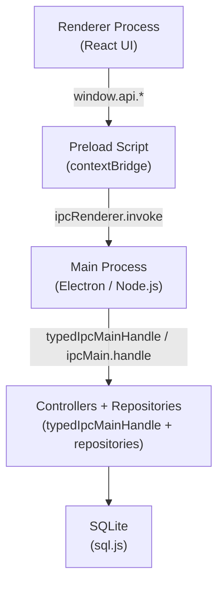
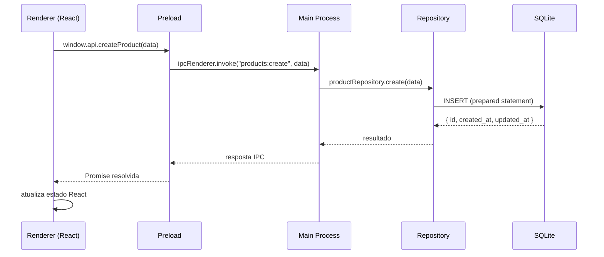

# 🏗️ Arquitetura do sistema

## 1. Visão geral

Este projeto é um aplicativo desktop construído com **Electron + React + TypeScript**, organizado em três camadas com responsabilidades bem delimitadas:

| Camada           | Tecnologia             | Responsabilidade principal                    |
| ---------------- | ---------------------- | --------------------------------------------- |
| **Main Process** | Electron / Node.js     | Lógica de negócio, persistência, acesso ao SO |
| **Preload**      | Electron contextBridge | Ponte segura entre renderer e main            |
| **Renderer**     | React + TypeScript     | Interface do usuário e estado de UI           |

A persistência é feita exclusivamente com **SQLite** via **sql.js**, operando 100% offline.

> [!IMPORTANT]
> O renderer **nunca** acessa Node.js, o sistema de arquivos ou o banco de dados diretamente. Toda comunicação deve passar pelo canal IPC definido em [`api-contracts.md`](api-contracts.md).

---

## 2. Diagrama de camadas



---

## 3. Estrutura de pastas

```txt
bussiness_management/
├── electronApp.ts            # Ponto de entrada do Electron (main process)
├── backend/
│   ├── controllers/          # Handlers IPC — registram os canais tipados
│   ├── infra/
│   │   ├── typedIpc.ts       # Wrapper tipado sobre ipcMain.handle
│   │   └── database/
│   │       ├── sqlite.ts     # Configuração e conexão com o banco
│   │       ├── schema.ts     # Criação de tabelas (DDL)
│   │       ├── helpers.ts    # Utilitários de banco (timestamps, etc.)
│   │       ├── paths.ts      # Resolução de caminho do arquivo .db
│   │       └── tables/
│   │           ├── productTables.ts
│   │           └── saleTables.ts
│   ├── repository/
│   │   ├── productRepository.ts
│   │   └── saleRepository.ts
│   └── preload.ts            # Ponte contextBridge
├── renderer/                 # Aplicação React (UI)
├── shared/
│   ├── index.ts              # Reexporta contratos e modelos compartilhados
│   ├── contracts/
│   │   ├── ipcApi.ts         # Interface da API exposta ao renderer
│   │   └── ipcContracts.ts   # Envelope ApiResponse
│   ├── models/
│   │   ├── product.ts
│   │   ├── sale.ts
│   │   └── dtos/
│   │       ├── productDto.ts
│   │       └── saleDto.ts
│   └── types/
│       └── sqljs.d.ts
└── docs/                     # Documentação do projeto
```

---

## 4. Responsabilidades por camada

### 4.1 Main Process (`electronApp.ts` + `backend/controllers/` + `backend/infra/typedIpc.ts`)

**Responsável por:**

- Criar e gerenciar a janela do Electron;
- Gerenciar o ciclo de vida da aplicação e do banco;
- Registrar handlers tipados para cada canal IPC;
- Orquestrar chamadas aos repositories;

**Regras:**

- Nunca expor APIs internas diretamente ao renderer;
- Toda operação sensível (banco, SO, arquivos) deve ocorrer aqui;
- Handlers devem delegar persistência aos repositories, nunca executar SQL diretamente;

---

### 4.2 Camada de persistência (`backend/infra/database/` + `backend/repository/`)

O banco é acessado exclusivamente pelo Main Process através da seguinte organização:

```txt
backend/infra/database/
  ├── sqlite.ts     → abre/fecha conexão, exporta instância db
  ├── schema.ts     → executa CREATE TABLE (rodado na inicialização)
  ├── helpers.ts    → funções auxiliares (ex: gerar timestamps)
  ├── paths.ts      → resolve o caminho do arquivo .db em dev e produção
  └── tables/       → mapeamento entre linhas SQLite e modelos compartilhados

backend/repository/
  ├── productRepository.ts   → CRUD de produtos
  └── saleRepository.ts      → CRUD de vendas e itens de venda
```

**Regras:**

- Todo SQL deve estar centralizado nos repositories;
- `created_at` e `updated_at` são gerenciados automaticamente pelos helpers;
- Nunca acessar `db` diretamente fora dos repositories;

---

### 4.3 Preload Script (`backend/preload.ts`)

**Responsável por:**

- Expor uma API controlada ao renderer via `contextBridge.exposeInMainWorld`;
- Encaminhar chamadas usando `ipcRenderer.invoke(canal, payload)`;
- Reutilizar os contratos tipados definidos em `shared/contracts/ipcApi.ts`;

**Regras:**

- Usar `contextIsolation: true` e `nodeIntegration: false` sempre;
- Expor **apenas** as funções listadas nos contratos de [`api-contracts.md`](api-contracts.md) e em `shared/contracts/ipcApi.ts`;
- Nunca expor referências diretas a módulos Node.js ou ao banco;

Exemplo de estrutura exposta:

```typescript
// backend/preload.ts
contextBridge.exposeInMainWorld("api", {
  createProduct: (data) => ipcRenderer.invoke("products:create", data),
  listProducts: () => ipcRenderer.invoke("products:list"),
  updateProduct: (data) => ipcRenderer.invoke("products:update", data),
  deleteProduct: (data) => ipcRenderer.invoke("products:delete", data),
  createSale: (data) => ipcRenderer.invoke("sales:create", data),
  listSales: () => ipcRenderer.invoke("sales:list"),
  getSaleById: (data) => ipcRenderer.invoke("sales:getById", data),
  deleteSale: (data) => ipcRenderer.invoke("sales:delete", data),
});
```

---

### 4.4 Renderer Process (`renderer/`)

**Responsável por:**

- Renderizar a interface (React);
- Gerenciar estado de UI;
- Chamar `window.api.*` para qualquer operação de dados;

**Regras:**

- Não importar nem usar APIs de Node.js, `fs`, `path`, ou acesso direto ao banco;
- Não acessar banco ou sistema de arquivos de forma direta;
- Lógica de negócio e validações de domínio devem estar no Main Process;

---

### 4.5 Camada compartilhada (`shared/`)

Contém tipos e contratos TypeScript usados por **ambas** as camadas:

| Arquivo             | Conteúdo                                              |
| ------------------- | ----------------------------------------------------- |
| `shared/index.ts`   | Reexporta os contratos e modelos compartilhados       |
| `shared/contracts/` | `AppApi`, `ApiResponse` e helpers do envelope IPC     |
| `shared/models/`    | Entidades e DTOs compartilhados entre renderer e main |
| `shared/types/`     | Tipos auxiliares, como a integração com `sql.js`      |

**Objetivo:** eliminar duplicação e garantir consistência de tipos entre renderer e main.

---

## 5. Fluxo de dados (ponta a ponta)



---

## 6. Segurança

| Medida                   | Detalhe                                                    |
| ------------------------ | ---------------------------------------------------------- |
| `contextIsolation: true` | Renderer isolado do contexto Node.js                       |
| `nodeIntegration: false` | Renderer não tem acesso a APIs Node                        |
| `contextBridge`          | Único ponto de exposição controlada ao renderer            |
| Validação de dados       | Dados recebidos via IPC são validados antes de persistir   |
| SQL isolado              | Banco acessível somente pelos repositories no Main Process |

---

## 7. Convenções do projeto

- **Canais IPC:** formato `entidade:acao` (ex: `products:create`, `sales:list`);
- **Entidades:** sempre no plural nos canais e nos repositórios;
- **Timestamps:** `created_at` e `updated_at` em todas as entidades, formato ISO 8601;
- **Tipagem:** todos os payloads IPC tipados via `shared/` e validados no Main Process antes da persistência;
- **SQL:** sempre via prepared statements, centralizado nos repositories;
- **Async:** o IPC usa `async/await`, enquanto a persistência com `sql.js` é síncrona dentro dos repositories;

---

## 8. Referências

- [app-overview.md](app-overview.md) — objetivo, escopo e funcionalidades;
- [api-contracts.md](api-contracts.md) — contratos IPC detalhados (request/response);
- [decisions.md](decisions.md) — decisões técnicas e justificativas;
